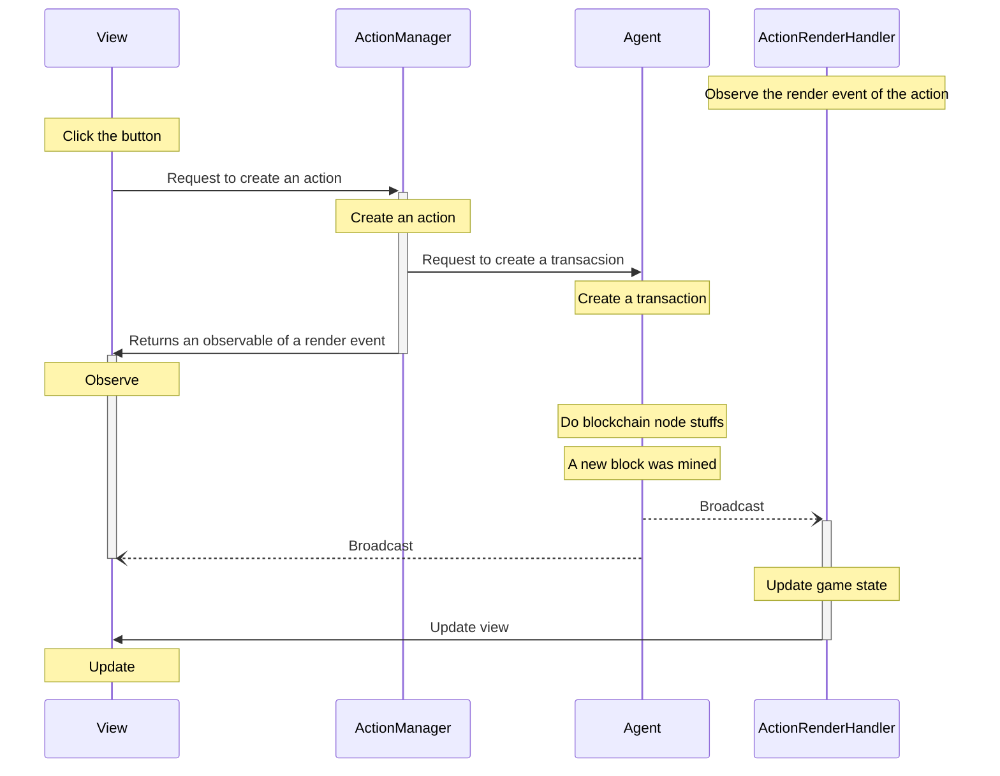

> 💡 This article was written based on Nine Chronicles version v100301[^v100301].

## Structure of handling actions in Unity


::: details Mermaid

:::

## Check actions on lib9c

The first thing to do is to check lib9c for the actions we want to deal with in 9c-unity.

> This document covers an action called 'TransferAsset'.

### TransferAsset actions list

There are several `TransferAsset` actions in lib9c as shown below.

| class name | action type |
| --- | --- |
| TransferAsset | "transfer_asset3" |
| TransferAsset0 | "transfer_asset" |
| TransferAsset2 | "transfer_asset2" |

In lib9c, actions that are responsible for specific functions are often upgraded to fix bugs or improve functions. And this is done by leaving the original as is and adding a new version of the action, where the class name and action type follow the convention for setting them as shown below.

### Change of the action class name and action type by action upgrade

Step 1. Create a new action class with new action type

- Create a new class as pascal case.
- Set the action type as snake case of the class name.

| class name | action type | desc |
| --- | --- | --- |
| TransferAsset | "transfer_asset" | new one |

Step 2. Upgrade the action

- Rename class name of old one consider action type.
- Create a new class as pascal case.(without version number)
- Set the action type of the new class above as snake case with a version number.
- The version number starts with `2`.

| class name | action type | desc |
| --- | --- | --- |
| TransferAsset | "transfer_asset2" | new one |
| TransferAsset0(or TransferAsset1) | "transfer_asset" | old one |

Step 3. Upgrade the action

| class name | action type | desc |
| --- | --- | --- |
| TransferAsset | "transfer_asset3" | new one |
| TransferAsset0(or TransferAsset1) | "transfer_asset" | old one |
| TransferAsset2 | "transfer_asset2" | old one |

### Obsoleted action

When upgrading an action, we usually obsolete the action from the previous version so that it is no longer available.

The obsolete processing status of the TransferAsset action.

| class name | action type | is obsoleted |
| --- | --- | --- |
| TransferAsset | "transfer_asset3" | no |
| TransferAsset0(or TransferAsset1) | "transfer_asset" | yes |
| TransferAsset2 | "transfer_asset2" | no |

As you can see above, There are cases where we didn't set the old actions to obsolete.

In 9c-unity, we are handling actions which is not obsoleted and I use the `TransferAsset` class in this article.

## Action creation

Responsibility for creating actions rests with [ActionManager][9c-action-manager-link].
I wrote a method that creates a `TransferAsset` action below.

[9c-action-manager-link]: https://github.com/planetarium/NineChronicles/blob/v100301/nekoyume/Assets/_Scripts/BlockChain/ActionManager.cs

```cs
public IObservable<ActionBase.ActionEvaluation<TransferAsset>> TransferAsset(
    Address sender,
    Address recipient,
    FungibleAssetValue amount,
    string memo)
{
    // Create an action.
    var action = new TransferAsset(
        sender,
        recipient,
        amount,
        memo);

    // Request to create a transaction to IAgent inside of ProcessAction method.
    ProcessAction(action);

    // Return observable of the first render of the `TransferAsset` rendered from now.
    return _agent.ActionRenderer.EveryRender<TransferAsset>()
        .Timeout(ActionTimeout)
        .First()
        .ObserveOnMainThread();
}
```

I found above method does not work and I improved it from [this pull request][pr-to-improve-iagent].

[pr-to-improve-iagent]: https://github.com/planetarium/NineChronicles/pull/2035

## Action render event handling

In 9c-unity, most action render events are handled by `ActionRenderHandler`.
And the render event handling method of the `TransferAsset` action has already been written [here][transfer-asset-render-handling-link].

[transfer-asset-render-handling-link]: https://github.com/planetarium/NineChronicles/blob/v100301/nekoyume/Assets/_Scripts/BlockChain/ActionRenderHandler.cs#L1532-L1570

```cs
private void ResponseTransferAsset(ActionBase.ActionEvaluation<TransferAsset> eval)
{
    // Check the action has an exceptions.
    if (!(eval.Exception is null))
    {
        return;
    }

    var senderAddress = eval.Action.Sender;
    var recipientAddress = eval.Action.Recipient;
    var currentAgentAddress = States.Instance.AgentState.address;
    var playToEarnRewardAddress = new Address("d595f7e85e1757d6558e9e448fa9af77ab28be4c");

    // If sender address of the TransferAsset action equals to current agent address,
    if (senderAddress == currentAgentAddress)
    {
        var amount = eval.Action.Amount;

        // Call some UI system.
        OneLineSystem.Push(MailType.System,
            L10nManager.Localize("UI_TRANSFERASSET_NOTIFICATION_SENDER", amount, recipientAddress),
            NotificationCell.NotificationType.Notification);
    }
    // else if recipient address of the TransferAsset action equals to current agent address,
    else if (recipientAddress == currentAgentAddress)
    {
        var amount = eval.Action.Amount;
        // // If sender address of the TransferAsset action equals to specific address,
        if (senderAddress == playToEarnRewardAddress)
        {
            // Call some UI system.
            OneLineSystem.Push(MailType.System,
                L10nManager.Localize("UI_PLAYTOEARN_NOTIFICATION_FORMAT", amount),
                NotificationCell.NotificationType.Notification);
        }
        else
        {
            // Call some UI system.
            OneLineSystem.Push(MailType.System,
                L10nManager.Localize("UI_TRANSFERASSET_NOTIFICATION_RECIPIENT", amount, senderAddress),
                NotificationCell.NotificationType.Notification);
        }
    }

    // Update agent state on game state asynchronously.
    UpdateAgentStateAsync(eval).Forget();
}
```

## Handling Action Render Events in the UI

Now, based on what I introduced above, it is possible to create an action from the UI and update the UI based on a specific event.

```cs
public class TransferAssetView : MonoBehaviour
{
    private Address _senderAddr;
    private Address _recipientAddr;
    private FungibleAssetValue _amount;
    private string _meno;
    private Button _button;

    // Invoked from `ActionRenderHandler` or other context.
    public void OnActionRendered()
    {
        // Do something.
    }

    // Invoked when `_button` clicked.
    private void OnButtonClick()
    {
        ActionManager.Instance
            .TransferAsset(_senderAddr, _recipientAddr, _amount, _meno)
            .Subscribe();
    }
}
```

---

[^v100301]: [lib9c:v100301][lib9c-v100301], [NineChronicles:v100301][9c-unity-v100301]

[lib9c-v100301]: https://www.github.com/planetarium/lib9c/tree/v100301
[9c-unity-v100301]: https://www.github.com/planetarium/NineChronicles/tree/v100301
