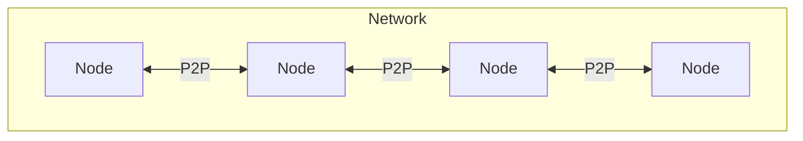
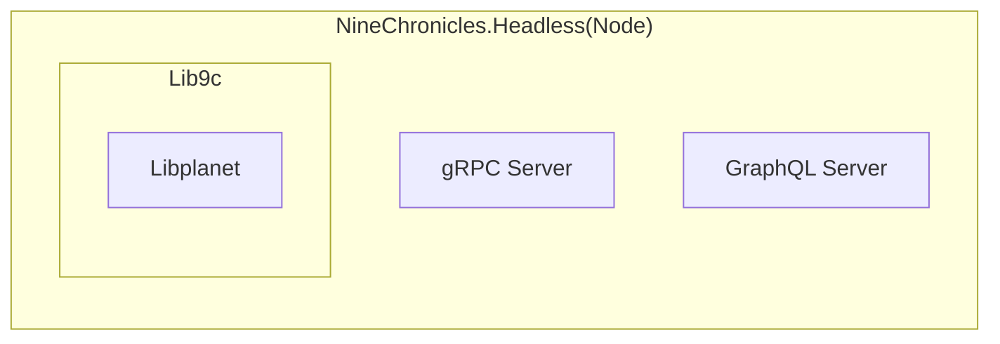
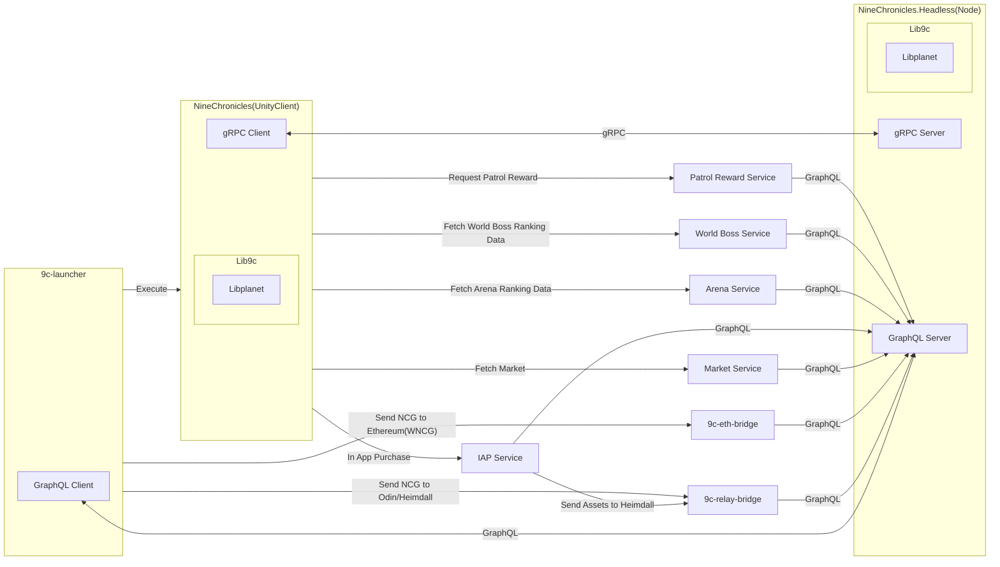

Welcome to the starting point for making your first contribution to the Nine Chronicles ecosystem.:tada: 
Before you make your first contribution, We'd like to explain the basic structure of the Nine Chronicles ecosystem, followed by the broader structure.

## Blockchain network

Nine Chronicles' blockchain network has a large number of nodes participating in it. The network works in a peer-to-peer fashion, with each node sending data to and from each other to maintain the blockchain.

The implementation of this node is `NineChronicles.Headless`. This is a node of Nine Chronicles, a core component of the blockchain network.

This node uses `Lib9c` and `Libplanet` to process blockchain data, and interacts with the outside world via **gRPC** and **GraphQL** servers.

## Gameplay

The primary way to play Nine Chronicles is to use the Unity client via the launcher.

The implementations of this launcher and the Unity client are `9c-launcher` and `NineChronicles`. The `9c-launcher` interacts with `NineChronicles.Headless` via the GraphQL client, and the Unity client interacts with `NineChronicles.Headless` via the gRPC client.

## Repositories

The various components of the Nine Chronicles ecosystem are spread across several GitHub repositories. Here's a list of the main repositories:

- [9c-launcher](https://github.com/planetarium/9c-launcher)
- [NineChronicles](https://github.com/planetarium/NineChronicles)
- [NineChronicles.Headless](https://github.com/planetarium/NineChronicles.Headless)
- [Lib9c](https://github.com/planetarium/lib9c)
- [Libplanet](https://github.com/planetarium/libplanet)
