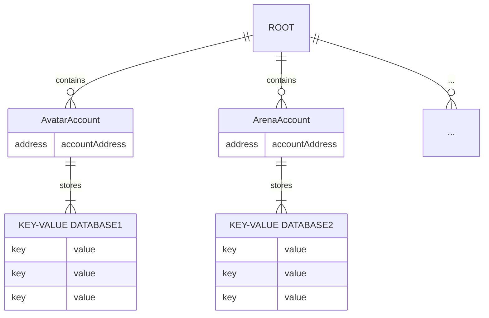

# Querying the Main Network Status

In this guide, we’ll learn how to query the blockchain status on the main network where the actual game is running using Headless, and explore what kind of data is available.

[nc-headless]: https://github.com/planetarium/NineChronicles.Headless

## Querying Status in the GraphQL Playground

Let’s revisit the query we used [earlier](./running-node-with-executor) and try it on one of the main networks, the [Odin network](../../general/multiplanetary), by accessing its GraphQL Playground.

- [Odin GraphQL Playground URL](https://9c-main-rpc-1.nine-chronicles.com/ui/playground)

Enter the following query to check the current status of the node:

```graphql
query {
  nodeStatus {
    tip {
      miner
      hash
      index
    }
  }
}
```

Here’s what the response might look like:

```json
{
  "data": {
    "nodeStatus": {
      "tip": {
        "miner": "0xb287F295d2C4e875Bde83A36F11B60d8d12b7976",
        "hash": "a88ded5a592503f2986d9288386af4c30669a8b82390fc46fa2fe29cb3b2fdc4",
        "index": 11136526
      }
    }
  },
  "extensions": {}
}
```

Just like querying a locally running network, you can easily use GraphQL to query the state of the network where the actual game is running.

## Understanding the Concept of Accounts

In `libplanet`, the concept of an `Account` functions similarly to a table in an RDB (Relational Database) to categorize blockchain data by purpose. Many pieces of data are stored separately in different `Accounts`, each identified by an `AccountAddress`. Each `Account` has its own key-value database where the data is stored.


> [!NOTE]
> The diagram above represents a simplified concept to help you understand how data is stored.

## Querying ActionPoint Account Data

Now, let’s query the `ActionPoint`, which functions like stamina in the game. You can find the address of the `Account` you’ll be querying at [this link](https://github.com/planetarium/lib9c/blob/main/Lib9c/Addresses.cs#L50).

```graphql
query {
  state(
    # Address of the ActionPoint Account
    accountAddress: "0000000000000000000000000000000000000021"
    # Address of the avatar playing the game
    address: "0xc106714d1bf09c37bcff24362eea5508d925f37a"
  )
}
```

The response should look something like this:

```json
{
  "data": {
    "state": "6931323065"
  },
  "extensions": {}
}
```

With this GraphQL query, you can easily retrieve the `ActionPoint` of an avatar.

Since the data is in `hex` format, it needs to be converted. Let’s use this [conversion site](https://www.rapidtables.com/convert/number/hex-to-ascii.html) for a quick conversion.

{width=480}

The converted value is `i120e`, which is encoded in Bencodex format. This encoding occurs because `libplanet` uses [Bencodex](https://github.com/planetarium/bencodex) for data encoding. Once you decode the value, it translates to `120`.

> [!NOTE]
> The `i` and `e` are added during the Bencodex encoding process.

::: tip :tada:
Well done! You’ve successfully used Headless to query actual game data and gain insight into the structure of blockchain data. Don’t worry if some concepts seem complex—it's okay not to grasp everything right away. Next, we’ll dive into working with private keys.
:::
