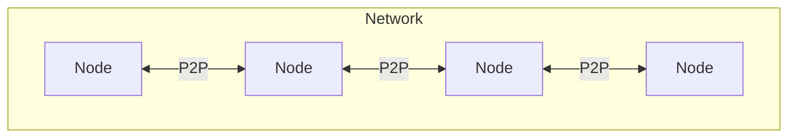
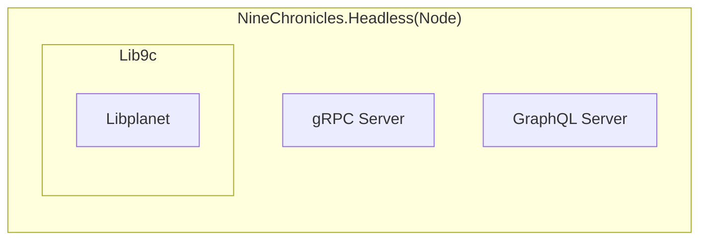
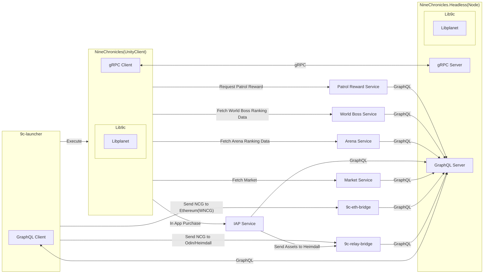

나인 크로니클 생태계에 첫 기여를 하기위한 출발점에 서신 것을 환영합니다.:tada: 
첫 기여를 하기 앞서서 나인 크로니클 생태계의 기본적인 구조를 설명하고, 이어서 좀 더 넓은 구조를 설명드리겠습니다.

## 블록체인 네트워크

나인 크로니클의 블록체인 네트워크에는 수 많은 노드가 참여하고 있습니다. 이 네트워크는 P2P 방식으로 작동하며, 각 노드는 서로 데이터를 주고받으며 블록체인을 유지합니다.

이 노드의 구현체가 바로 `NineChronicles.Headless` 입니다. 이는 나인 크로니클의 노드로서, 블록체인 네트워크의 핵심 구성 요소입니다.

이 노드는 `Lib9c`와 `Libplanet`을 사용하여 블록체인 데이터를 처리하고,  **gRPC** 및 **GraphQL** 서버를 통해 외부와 상호작용합니다.

## 게임 플레이

나인 크로니클을 플레이하는 대표적인 방법은 런처를 통해 유니티 클라이언트를 사용하는 것입니다.

이 런처와 유니티 클라이언트의 구현체들이 `9c-launcher`와 `NineChronicles` 입니다. `9c-launcher`는 GraphQL 클라이언트를 통해 `NineChronicles.Headless`와 상호작용하며, 유니티 클라이언트는 gRPC 클라이언트를 통해 `NineChronicles.Headless`와 상호작용합니다.

## 저장소 목록

나인 크로니클 생태계의 다양한 구성 요소들은 여러 GitHub 저장소에 나누어져 있습니다. 주요 저장소 목록은 다음과 같습니다.

- [9c-launcher](https://github.com/planetarium/9c-launcher)
- [NineChronicles](https://github.com/planetarium/NineChronicles)
- [NineChronicles.Headless](https://github.com/planetarium/NineChronicles.Headless)
- [Lib9c](https://github.com/planetarium/lib9c)
- [Libplanet](https://github.com/planetarium/libplanet)
