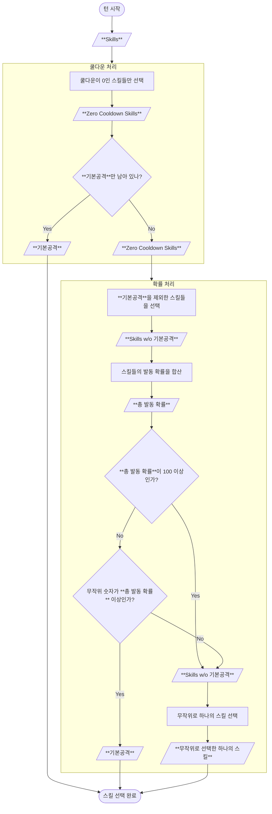

# 모험

플레이어는 자신의 아바타를 성장시키는 첫 단계로 모험 컨텐츠를 이용할 수 있습니다. 모험 컨텐츠에 대한 자세한 설명은 [공식 문서](https://docs.nine-chronicles.com/introduction/intro/game-contents/adventure)를 참고하세요.

## 월드 {#world}

나인 크로니클의 모험은 이그드라실에서 시작되고, 그 이후로 알프헤임, 스바르트알프헤임, 아스가르드 등의 순서로 새로운 월드들이 준비되어 있습니다. 이 데이터는 `WorldSheet`에서 가져옵니다.

- [Nekoyume.TableData.WorldSheet](https://github.com/planetarium/lib9c/blob/1.17.3/Lib9c/TableData/WorldAndStage/WorldSheet.cs)

9c-board 서비스[^9c-board]를 이용해서 `WorldSheet`를 확인해볼 수 있습니다.

- https://9c-board.nine-chronicles.dev/odin/tablesheet/WorldSheet
- https://9c-board.nine-chronicles.dev/heimdall/tablesheet/WorldSheet

모험을 시작하는 이그드라실은 아바타를 생성함과 동시에 열려 있는데요. 이후의 월드들은 특정 조건을 충족하면 잠금 해제됩니다. 자세한 정보는 `WorldUnlockSheet`에서 확인할 수 있습니다.

- [Nekoyume.TableData.WorldUnlockSheet](https://github.com/planetarium/lib9c/blob/1.17.3/Lib9c/TableData/WorldAndStage/WorldUnlockSheet.cs)

`WorldSheet`와 마찬가지로 9c-board에서 확인해볼 수 있습니다.

- https://9c-board.nine-chronicles.dev/odin/tablesheet/WorldUnlockSheet
- https://9c-board.nine-chronicles.dev/heimdall/tablesheet/WorldUnlockSheet

## 스테이지 도전과 보상 {#stage-and-rewards}

각 월드는 여러 스테이지를 포함하고 있으며, 각 스테이지를 클리어하면 다양한 보상을 받을 수 있습니다. 스테이지 정보는 `StageSheet`에서 확인할 수 있습니다.

- [Nekoyume.TableData.StageSheet](https://github.com/planetarium/lib9c/blob/1.17.3/Lib9c/TableData/WorldAndStage/StageSheet.cs)
- https://9c-board.nine-chronicles.dev/odin/tablesheet/StageSheet
- https://9c-board.nine-chronicles.dev/heimdall/tablesheet/StageSheet

### 스테이지 도전 비용 {#stage-and-rewards-stage-sheet-cost-ap}

`StageSheet`를 보면 `CostAP`라는 필드가 있습니다. 이 필드는 스테이지를 진행하는 데 필요한 액션 포인트를 나타냅니다. 플레이어는 [아바타의 액션 포인트](./1-transaction-and-action#action-point)를 사용해서 모험을 진행할 수 있습니다.

## 스테이지 웨이브 {#stage-waves}

스테이지는 여러 웨이브로 구성되어 있으며, 각 웨이브를 클리어해야 다음 웨이브로 넘어갈 수 있습니다. 웨이브 정보는 `StageWaveSheet`에서 확인할 수 있습니다.

- [Nekoyume.TableData.StageWaveSheet](https://github.com/planetarium/lib9c/blob/1.17.3/Lib9c/TableData/WorldAndStage/StageWaveSheet.cs)
- https://9c-board.nine-chronicles.dev/odin/tablesheet/StageWaveSheet
- https://9c-board.nine-chronicles.dev/heimdall/tablesheet/StageWaveSheet

나인 크로니클은 현재 모든 스테이지의 웨이브를 3개로 설정해두고 있는데요. 아바타가 몇 개의 웨이브를 클리어했느냐가 스테이지에서 달성한 별의 수를 결정하게 됩니다. 또한 별의 수는 아래와 같이 보상의 내용을 결정합니다.

- 별 1개: 경험치
- 별 2개: 경험치, 아이템
- 별 3개: 경험치, 아이템, 다음 스테이지 해금

## 스테이지 버프 {#stage-buff}

스테이지 버프는 플레이어가 특정 스테이지를 진행할 때 받을 수 있는 버프를 의미합니다. 이러한 버프는 `CrystalRandomBuffSheet`와 `CrystalStageBuffGachaSheet`에서 확인할 수 있습니다.

- [Nekoyume.TableData.Crystal.CrystalRandomBuffSheet](https://github.com/planetarium/lib9c/blob/1.17.3/Lib9c/TableData/Crystal/CrystalRandomBuffSheet.cs)
- [Nekoyume.TableData.Crystal.CrystalStageBuffGachaSheet](https://github.com/planetarium/lib9c/blob/1.17.3/Lib9c/TableData/Crystal/CrystalStageBuffGachaSheet.cs)

## 아이템 슬롯 {#item-slots}

모험을 진행할 때 사용할 수 있는 아이템 슬롯이 있습니다. 이 슬롯에는 다양한 아이템을 장착하여 전투를 유리하게 이끌 수 있습니다. 
모험에서 사용할 수 있는 아이템은 장비나 코스튬 그리고 음식이 있습니다.

## 룬 슬롯 {#rune-slots}

모험을 진행할 때 룬을 장착하여 다양한 효과를 얻을 수 있습니다.

## 반복 전투 {#repeat-battle}

모험은 반복적으로 진행할 수 있으며, 이를 위해 AP 포션을 사용할 수 있습니다.

## 전투(StageSimulator) {#battle}

전투는 턴제 방식으로 진행되며, 플레이어는 자신의 아바타와 함께 다양한 아이템을 사용하여 적을 물리칠 수 있습니다. 모험에서는 [StageSimulator](https://github.com/planetarium/lib9c/blob/1.17.3/Lib9c/Battle/StageSimulator.cs) 클래스를 활용해서 전투를 진행합니다. 이 클래스는 전투의 흐름을 관리하고, 각 턴마다 발생하는 이벤트를 처리합니다.

전투가 시작되면 플레이어 아바타를 생성합니다.

- [Nekoyume.Model.BattleStatus.SpawnPlayer](https://github.com/planetarium/lib9c/blob/1.17.3/Lib9c/Model/BattleStatus/SpawnPlayer.cs)

### 웨이브 {#battle-wave}

전투가 시작되면 첫 번째 웨이브가 시작됩니다. 웨이브를 클리어하지 못하면 전투가 종료되고, 클리어하면 다음 웨이브로 넘어갑니다. 그리고 마지막 웨이브를 클리어하면 전투가 종료됩니다.

- [Nekoyume.Model.BattleStatus.SpawnWave](https://github.com/planetarium/lib9c/blob/1.17.3/Lib9c/Model/BattleStatus/SpawnWave.cs)

### 턴 {#battle-turn}

웨이브가 시작되면 정해진 공식에 따라서 가장 우선순위가 높은 캐릭터에게 턴을 부여하는데요. 이 우선순위는 캐릭터의 SPD(속도) 스탯에 따라 결정됩니다.

1. 웨이브 시작.
2. 플레이어 아바타는 **100[^simulator-turn-priority] / 아바타의 SPD 스탯**의 우선순위를 갖습니다.
3. 웨이브의 모든 적은 **100 / 적의 SPD 스탯**의 우선순위를 갖습니다.
4. 우선순위가 가장 높은 즉, **100 / SPD 스탯**이 가장 작은 캐릭터에게 턴을 부여합니다.
5. (4)에서 턴을 부여 받은 캐릭터는 턴을 진행합니다.
6. (4)에서 턴을 부여 받지 못한 캐릭터들의 우선순위를 높입니다.
   - 캐릭터가 플레이어이고 이전 턴에서 **기본공격**이 아닌 스킬을 사용했다면 `0.9`를 곱합니다.
   - 이외의 경우에는 `0.6`을 곱합니다.
7. (4)에서 턴을 부여 받은 캐릭터는 다시 **100 / 캐릭터 SPD 스탯**의 우선순위를 갖습니다.
8. 플레이어 아바타가 죽거나 웨이브를 클리어할 때까지 (2)부터 (7)까지의 과정을 반복합니다.
9. 웨이브 종료. 다음 웨이브가 존재하면 (1)부터 반복합니다.

### 스킬 발동 {#battle-skill-activation}

아바타나 적을 포함한 모든 캐릭터는 스킬을 발동할 수 있습니다. 스킬에는 **기본공격**을 포함해서 다양한 공격 스킬과 버프 스킬들이 있는데요. 어떤 스킬이 발동되는지는 각 스킬이 갖고 있는 발동 확률에 따라 결정됩니다.

**스킬 종류**

- [Nekoyume.Model.BattleStatus.NormalAttack](https://github.com/planetarium/lib9c/blob/1.17.3/Lib9c/Model/BattleStatus/NormalAttack.cs): **기본공격**입니다.
- [Nekoyume.Model.BattleStatus.BlowAttack](https://github.com/planetarium/lib9c/blob/1.17.3/Lib9c/Model/BattleStatus/BlowAttack.cs)
- [Nekoyume.Model.BattleStatus.DoubleAttack](https://github.com/planetarium/lib9c/blob/1.17.3/Lib9c/Model/BattleStatus/DoubleAttack.cs)
- [Nekoyume.Model.BattleStatus.DoubleAttackWithCombo](https://github.com/planetarium/lib9c/blob/1.17.3/Lib9c/Model/BattleStatus/DoubleAttackWithCombo.cs)
- [Nekoyume.Model.BattleStatus.AreaAttack](https://github.com/planetarium/lib9c/blob/1.17.3/Lib9c/Model/BattleStatus/AreaAttack.cs)
- [Nekoyume.Model.BattleStatus.BuffSkill](https://github.com/planetarium/lib9c/blob/1.17.3/Lib9c/Model/BattleStatus/BuffSkill.cs)
- [Nekoyume.Model.BattleStatus.HealSkill](https://github.com/planetarium/lib9c/blob/1.17.3/Lib9c/Model/BattleStatus/HealSkill.cs)
- [Nekoyume.Model.BattleStatus.BuffRemovalAttack](https://github.com/planetarium/lib9c/blob/1.17.3/Lib9c/Model/BattleStatus/BuffRemovalAttack.cs)
- ...

### 콤보 {#battle-combo}

아바타의 공격은 콤보 효과를 얻을 수 있습니다.

- 최대 콤보는 아바타의 레벨에 따라 달라집니다. 예를 들어, 레벨 1에서는 최대 2콤보, 레벨 250에서는 최대 5콤보를 얻을 수 있습니다.
- 최대 콤보를 얻은 후에 [콤보 증가 조건](#battle-combo-increase)을 달성하면 1콤보부터 시작한다.

**콤보 증가** {#battle-combo-increase}

- 기본공격을 성공한다.
- `SkillSheet.Combo` 필드가 `true`인 스킬을 성공시킨다.

**콤보 초기화** {#battle-combo-reset}

- 기본공격을 실패한다.

**콤보 효과** {#battle-combo-effect}

- 기본공격이나 `SkillSheet.Combo` 필드가 `true`인 스킬의 데미지를 증가시킨다.
   - [Nekoyume.Model.CharacterBase.GetDamage](https://github.com/planetarium/lib9c/blob/1.17.3/Lib9c/Model/Character/CharacterBase.cs#L524)
   - [Nekoyume.Battle.AttackCountHelper.GetDamageMultiplier](https://github.com/planetarium/lib9c/blob/1.17.3/Lib9c/Battle/AttackCountHelper.cs#L23)
- 조건데 따라 추가 치명타 확률을 얻는다.
   - [Nekoyume.Model.CharacterBase.IsCritical](https://github.com/planetarium/lib9c/blob/1.17.3/Lib9c/Model/Character/CharacterBase.cs#L490)
   - [Nekoyume.Battle.AttackCountHelper.GetAdditionalCriticalChance](https://github.com/planetarium/lib9c/blob/1.17.3/Lib9c/Battle/AttackCountHelper.cs#L37)

## 관련 액션 {#actions}

모험 컨텐츠와 관련한 액션 목록:

- [DailyReward](https://github.com/planetarium/lib9c/blob/1.17.3/Lib9c/Action/DailyReward.cs): 액션을 실행하기 위해서 필요한 액션 포인트를 얻을 수 있습니다.
- [HackAndSlash](https://github.com/planetarium/lib9c/blob/1.17.3/Lib9c/Action/HackAndSlash.cs): 기본 모험 액션입니다.
- [HackAndSlashSweep](https://github.com/planetarium/lib9c/blob/1.17.3/Lib9c/Action/HackAndSlashSweep.cs): 별을 3개 달성한 스테이지를 소탕하는 액션입니다.

[^9c-board]: 9c-board는 나인 크로니클의 다양한 데이터를 시각화해주는 서비스입니다.
[^simulator-turn-priority]: 시뮬레이터에서 턴 우선순위를 결정하는 공식에 사용되는 값으로 [Nekoyume.Battle.Simulator.TurnPriority](https://github.com/planetarium/lib9c/blob/1.17.3/Lib9c/Battle/Simulator.cs#L21)에서 확인할 수 있습니다.
