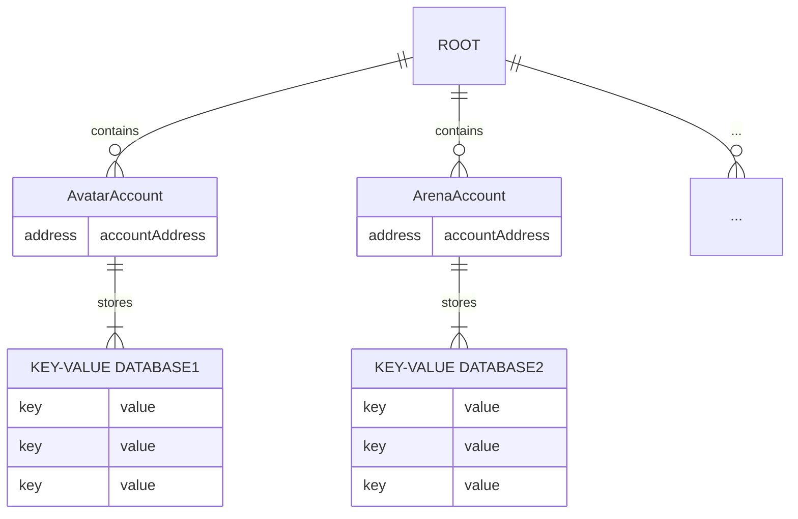

# 메인 네트워크에서 상태 조회하기

이 문서는 Headless를 이용해 실제 게임이 구동되고 있는 메인 네트워크에서 블록체인 상태를 조회하는 방법을 배워보고 어떤 데이터들이 존재하는지 확인해보겠습니다.

[nc-headless]: https://github.com/planetarium/NineChronicles.Headless

## GraphQL Playground에서 상태 조회하기

[앞에서](./running-node-with-executor) 실행해봤던 쿼리를 메인 네트워크 중 하나인 [Odin 네트워크](../../general/multiplanetary)의 GraphQL Playground URL에 접속해서 조회해보겠습니다.

- [Odin GraphQL Playground URL](https://9c-main-rpc-1.nine-chronicles.com/ui/playground)

```graphql
query {
  nodeStatus {
    tip {
      miner
      hash
      index
    }
  }
}
```
이렇게 노드의 현재 상태를 조회해볼 수 있습니다.
```json
{
  "data": {
    "nodeStatus": {
      "tip": {
        "miner": "0xb287F295d2C4e875Bde83A36F11B60d8d12b7976",
        "hash": "a88ded5a592503f2986d9288386af4c30669a8b82390fc46fa2fe29cb3b2fdc4",
        "index": 11136526
      }
    }
  },
  "extensions": {}
}
```
이렇게 로컬에서 실행했던 네트워크와 동일하게 실제 게임이 구동되고 있는 네트워크의 상태도 GraphQL을 통해 쉽게 조회할 수 있습니다.

## Account 개념 이해하기

`libplanet`에서는 블록체인 데이터를 용도별로 구분하여 저장하기 위해 RDB의 Table과 같은 개념으로 `Account`라는 개념이 존재합니다.  
많은 데이터들이 `Account`에 각각 분리되어 저장 되며 식별자로 `AccountAddress`를 가지게 됩니다.  
그리고 `Account`마다 key-value DB를 가지게 되며 해당 DB에 데이터를 저장하게 됩니다.  


> [!NOTE]
> 대략적으로 위와 같이 데이터가 저장되며, 이해를 돕기 위해 간략하게 함축한 내용입니다.

## ActionPoint Account 데이터 조회하기

이제 게임 내에서 스테미너와 비슷한 역할을 하는 `ActionPoint`를 조회해보겠습니다.  
조회해볼 `Account`의 주소는 [해당 링크](https://github.com/planetarium/lib9c/blob/main/Lib9c/Addresses.cs#L50)에 있습니다.

```graphql
query {
  state(
    # ActionPoint Account의 주소
    accountAddress: "0000000000000000000000000000000000000021"
    # 게임을 플레이하고 있는 아바타의 주소
    address: "0xc106714d1bf09c37bcff24362eea5508d925f37a"
  )
}
```

```json
{
  "data": {
    "state": "6931323065"
  },
  "extensions": {}
}
```

이렇게 GQL로 간단하게 아바타의 `ActionPoint`를 조회해볼 수 있습니다.  

조회된 데이터는 `hex`값이기 때문에 변환 과정이 필요합니다. 이번엔 간단하게 [변환 사이트](https://www.rapidtables.com/convert/number/hex-to-ascii.html)를 사용하여 변환하겠습니다.

{width=480}

변환된 값으로 bencodex 형식으로 인코딩된 `i120e` 문자열이 나왔습니다.  
이는 `libplanet`에서 [Bencodex](https://github.com/planetarium/bencodex)로 인코딩을 진행하기 때문입니다. 디코딩을 진행하면 `120`이라는 값이 나옵니다.

> [!NOTE]
> i와 e가 붙어있는 이유는 bencodex에서 인코딩을 진행하며 붙이는 값들이기 때문입니다.

::: tip :tada:
수고하셨습니다! Headless를 사용해 실제 게임 데이터를 조회하며 블록체인 데이터 구조를 이해해보았습니다. 어려운 개념들이 나왔지만, 모든 내용을 완벽히 이해하지 못해도 괜찮습니다. 다음으로는 private key에 대해 다루겠습니다.
:::
